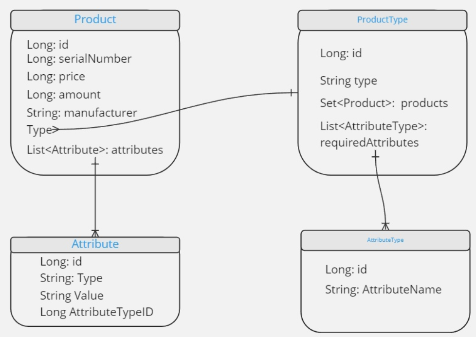

# CFT-Task-Products

## Сборка

* Java 17
* Система сборки - Gradle
* Зависимости в build.gradle, никаких jar, локальных репозиториев
  и другого не использовалось.
* Настройка БД и другого - в [application properties](./src/main/resources/application.properties)
* Начальные значения (вследствие удобства для разработки) загружаются в
  [java-файле](./src/main/java/tsukanov/mikhail/products/Configuration.java)

## Предложения по расширению

* Изменить структуру разных entity, на Map, для удобства
* Доделать связь между attributeRecuired и самими аттрибутами
* Сделать кастомную валидацию входных данных
* Добавить swagger для генерации Rest API
* Возможно, заменить обработку ошибок через `Exception`, а не через
  [Maybe](./src/main/java/tsukanov/mikhail/products/utils/Maybe.java)
* Добавить функционал к контроллерам и сервисам
* Оптимизировать архитектуру базы данных

## Устройство базы данных:



## Rest API

**Базовая документация**

### *Добавление продукта:*

* **Get** `/product/add/product`

* RequestBody:
  ```json 
  {
        "serialNumber": 322,
        "amount": 228,
        "price": 1.0,
        "manufacturer": "ITMO",
        "productType": "laptop",
        "attributes": [
            {
                "attributeType": "String",
                "attributeName": "size",
                "value": "25"
            }
        ]
  }
  ```
* ResponseBody:
    ```json
  {
    "id": 4,
    "serialNumber": 322,
    "amount": 228,
    "price": 1.0,
    "manufacturer": "ITMO",
    "productType": {
        "id": 1,
        "name": "laptop"
    },
    "attributes": [
        {
            "id": 4,
            "attributeType": "String",
            "attributeName": "size",
            "value": "25"
        }
    ]
  }
    ```

### *Редактирование продукта:*

* **POST** `/product/change/product`

* RequestBody:
  ```json 
  {
    "id": 1,
    "amount": 2,
    "price": 2.0,
    "attributeUpdates": [
        {
            "changeType": "change",
            "attribute": {
                "attributeName": "size",
                "value": "1"
            }
        },
        {
            "changeType": "add",
            "attribute": {
                "attributeName": "usb_ports",
                "attributeType": "Integer",
                "value": "2"
            }
        }
    ]
  }
  ```
* ResponseBody:
    ```json
  {
    "id": 1,
    "serialNumber": 1,
    "amount": 2,
    "price": 2.0,
    "manufacturer": "NSU",
    "productType": {
        "id": 1,
        "name": "laptop"
    },
    "attributes": [
        {
            "id": 5,
            "attributeType": "Integer",
            "attributeName": "usb_ports",
            "value": "2"
        },
        {
            "id": 1,
            "attributeType": "Integer",
            "attributeName": "size",
            "value": "1"
        }
    ]
  }
    ```

### *Редактирование продукта:*

* **POST** `/product/change/product`

* RequestBody:
  ```json 
  {
    "id": 1,
    "amount": 2,
    "price": 2.0,
    "attributeUpdates": [
        {
            "changeType": "change",
            "attribute": {
                "attributeName": "size",
                "value": "1"
            }
        },
        {
            "changeType": "add",
            "attribute": {
                "attributeName": "usb_ports",
                "attributeType": "Integer",
                "value": "2"
            }
        }
    ]
  }
  ```
* ResponseBody:
    ```json
  {
    "id": 1,
    "serialNumber": 1,
    "amount": 2,
    "price": 2.0,
    "manufacturer": "NSU",
    "productType": {
        "id": 1,
        "name": "laptop"
    },
    "attributes": [
        {
            "id": 5,
            "attributeType": "Integer",
            "attributeName": "usb_ports",
            "value": "2"
        },
        {
            "id": 1,
            "attributeType": "Integer",
            "attributeName": "size",
            "value": "1"
        }
    ]
  }
    ```

### *Удаление продукта:*

* **DELETE** `/product/remove/byid/{id}`

* RequestParameter:
  ```
  Long: id
  ```
* ResponseBody:
    ```json
  {
    "id": 2,
    "serialNumber": 2,
    "amount": 15,
    "price": 2.0,
    "manufacturer": "Omsk",
    "productType": {
        "id": 2,
        "name": "desktop_computer"
    },
    "attributes": [
        {
            "id": 2,
            "attributeType": "String",
            "attributeName": "form_factor",
            "value": "desktop"
        }
    ]
  }
    ```

### *Продукты по типу:*

* **Get** `/producttype/products/find/bytype/{type}`

* RequestParameter:
  ```
  String: type
  ```
* ResponseBody:
    ```json
  [
     {
        "id": 1,
        "serialNumber": 1,
        "amount": 2,
        "price": 2.0,
        "manufacturer": "NSU",
        "attribute": [
            {
                "id": 5,
                "attributeType": "Integer",
                "attributeName": "usb_ports",
                "value": "2"
            },
            {
                "id": 1,
                "attributeType": "Integer",
                "attributeName": "size",
                "value": "1"
            }
        ]
    }
  ]
    ```

### *Продукты по id:*

* **Get** `/product/find/byid/{id}`

* RequestParameter:
  ```
  id: Long
  ```
* ResponseBody:
    ```json
  {
    "id": 1,
    "serialNumber": 1,
    "amount": 2,
    "price": 2.0,
    "manufacturer": "NSU",
    "productType": {
        "id": 1,
        "name": "laptop"
    },
    "attributes": [
        {
            "id": 5,
            "attributeType": "Integer",
            "attributeName": "usb_ports",
            "value": "2"
        },
        {
            "id": 1,
            "attributeType": "Integer",
            "attributeName": "size",
            "value": "1"
        }
    ]
  }
    ```

### Типичный формат ошибки:

```json
{
  "errorMessage": String,
  "status": String
}
```

Примеры:

```json
{
  "errorMessage": "There is no product with id: 2",
  "status": "NOT_FOUND"
}
```

```json
{
  "errorMessage": "There is no type laptope",
  "status": "NOT_FOUND"
}
```

```json
{
  "errorMessage": "There is no manufacturer",
  "status": "BAD_REQUEST"
}
```

```json
{
  "errorMessage": "There is no next requiredAttributes: [AttributeType{id=1, attributeTypeName='size'}]",
  "status": "BAD_REQUEST"
}
```